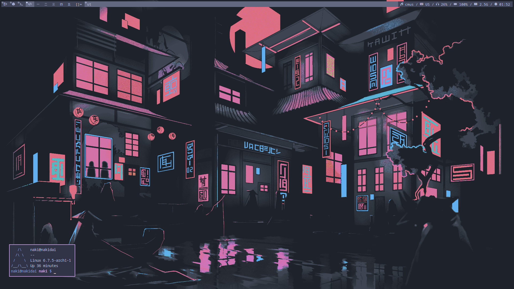

DWM rice
--
It includes patched dwm with gaps, st and tcsh config, all in the catppuccin frappe theme.  
  

Bar
--
I wrote this in python, because why not? Please keep sysbar.py and dwmbar/ together, because sysbar.py includes last one.  

Background
--
Source [there](https://rare-gallery.com/39819-the-neon-shallowsnight-neon.html) I think (I downloaded it a long time ago, so I just used google search).  

Installation
--
Firstly edit dwm config (defines at the top of config.h, bindings). Then edit tcsh/.tcshrc for your needs.  
Build and install dwm and st, copy files from tcsh/ to your home.  
To run bar you can write something like this in the `.xinitrc`:  
```sh
python path/to/sysbar.py &
exec dwm
```

Dependencies
--
DWM additionally depends on scrot for screenshots and amixer (`alsa-utils` in archlinux).  
Bar depends on python, psutils python package for pc info and [getlayout](https://github.com/nakidai/getlayout) script for getting X11 layout.  
