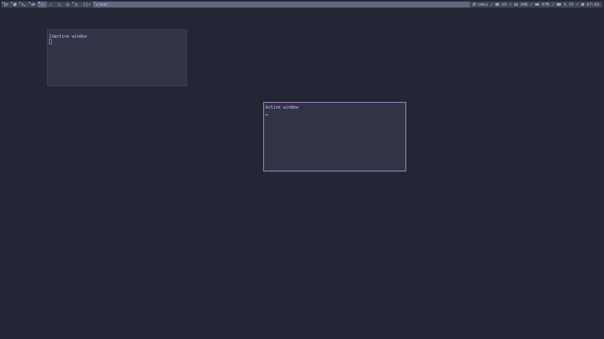

DWM
--
Dynamic Window Manager(dwm) 6.2 with patches for gaps  

Bar
--
I use my own [bar](https://git.nakidai.ru/nakidai/dwmbar) written in python. Bar script itself you can find [there](https://git.nakidai.ru/nakidai/dwmscripts/src/branch/master/sysbar.py).  
To run it just write something like this in your `.xinitrc`:  
```sh
python sysbar.py &
exec dwm
```

Themes
--
- Catppuccin frappe  
- Catppuccin latte  
- Tokyo night  
To change theme change include on line 4  

Screenshot
--
#### With frappe theme:

